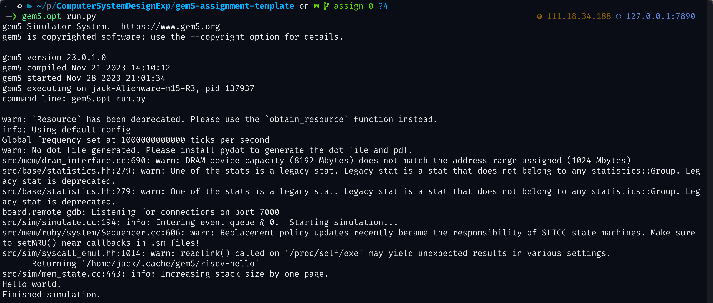
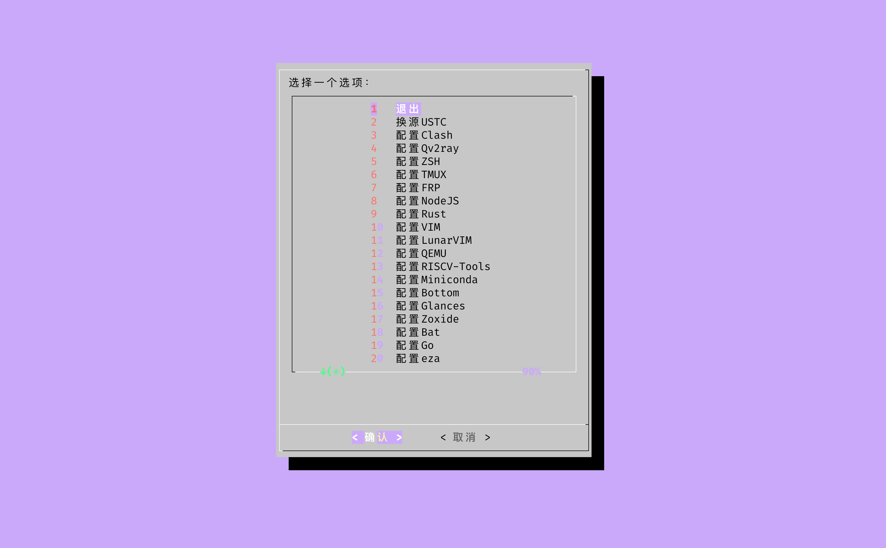
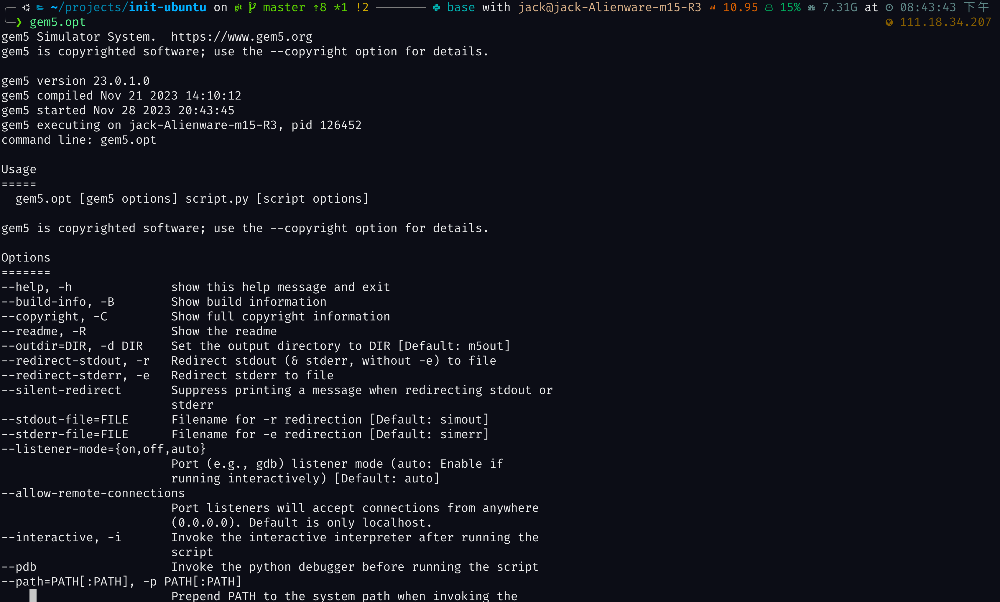

# 计算机系统综合实验 - Fall 2023



本仓库为计算机系统综合实验代码, 因为今年实验刚刚改版, 没有前人的代码可以参考, 因此本仓库本意是为了方便后来的学弟学妹们参考学习. 

请后来的学弟学妹们参考学习, 动手实践出来效果, 不要直接提交报告 :)


# 使用

本仓库每个`Exp`目录对应一个实验. 每个目录中都有一个脚本, 运行即可按照实验要求完成实验.
```bash
# 运行实验3
bash Exp3/script.sh
# 运行实验4
bash Exp4/script.sh
```

# 安装

## 下载仓库

本仓库提供了一系列脚本来简化使用. 首先运行下面的命令下载本仓库:

```bash
git clone https://github.com/jackwang0108/ComputerSystemDesignExp.git
```

## 初始化子模块

本项目依赖`Gem5`和`Gem5-Assignment-Template`, 并且以子模块的形式加入到本仓库. 因此运行下面的命令初始化他们

```bash
cd <path-to-project>
git submodule --init
git submodule update --recursive
```
**如果因为网络问题导致初始化失败, 则可以使用下面的命令为Git设置代理.** 注意将`[代理端口]`替换为你的代理软件监听的端口
```bash
git config --global https.proxy http://127.0.0.1:[代理端口]
git config --global https.proxy https://127.0.0.1:[代理端口]
```

**如果你没有代理软件而且不知道如何设置代理端口, 可以参考我的另外一个仓库: [InitUbuntu](https://github.com/jackwang0108/InitUbuntu).**

`InitUbuntu`中提供了一系列脚本帮助你自动初始化一个崭新安装的`Ubuntu`, 即便在你没有代理的情况下. 其中包括了两个代理软件: `clash` 和 `qv2ray`

`InitUbuntu`使用截图:



## 编译Gem5
`Gem5`是一个广泛使用的计算机系统模拟器, 用于研究和开发计算机体系结构, 微处理器设计, 内存系统, 缓存系统和其他相关领域. `Gem5`可以模拟多种处理器架构, 包括x86, ARM, RISC-V等.

**在计算机系统综合实验中, 我们会使用`Gem5`模拟一个计算机系统, 并运行工作负载(通常是一个`C/C++`程序), 来探究不同的系统架构对计算机系统性能的影响.为此, 我们需要首先编译, 安装`Gem5`.**

第一次实验, 即`实验一`(`Exp1`)的目标就是编译, 安装 `Gem5`. 你当然可以跟随实验课堂上的教学一步一步安装`Gem5`, 也可以跟随这里的指导一步步安装.

**注意: `Gem5`编译过程会使用到`Python`, 而`Anaconda`管理的`Python`和系统中的`Python`会发生冲突, 因此在安装前请确保运行`conda deactivate`退出所有`Conda Python`环境.**

### 懒人方法: 

我提供了一个脚本一键化编译, 安装`Gem5`:

```bash
bash Exp1/install.sh
```
**编译过程大概30分钟左右.** 编译结束后.

### 手动安装

首先下载系统依赖和`Python`依赖
```bash
# 安装系统依赖
sudo apt install build-essential git m4 scons zlib1g zlib1g-dev libprotobuf-dev protobuf-compiler libprotoc-dev libgoogle-perftools-dev python3-dev python-is-python3 libboost-all-dev pkg-config
# 安装Python依赖
python -m pip install -r "${dir}"/gem5/requirements.txt
```

然后修改编译目标. 将`<path-to-project>/gem5/build_opts/RISCV`文件中下述行
```bash
PROTOCOL = 'MI_example'
```
修改为
```bash
PROTOCOL = 'MESI_Two_Level'
```

然后利用`scons`进行编译, **编译过程大概30分钟左右**
```bash
scons build/RISCV/gem5.opt -j "$(nproc)"
```

编译完成后, 将编译得到的`gem5`可执行文件路径添加到`PATH`环境变量中. 注意替换`<path-to-project>`为实际路径, `config`替换为你的`Shell`的配置文件
```bash
config=~/.zshrc
gem5_path=<path-to-project>/gem5/build/RISCV/
echo 'export PATH="${PATH}":'"${gem5_path}" >>"${config}"
```


### 使用Gem5
安装完`Gem5`后, 重新加载`Shell`配置文件即可使用
```bash
source ~/.zshrc
# 或者
source ~/.bashrc
```

运行`gem5.opt`即可运行`Gem5`
